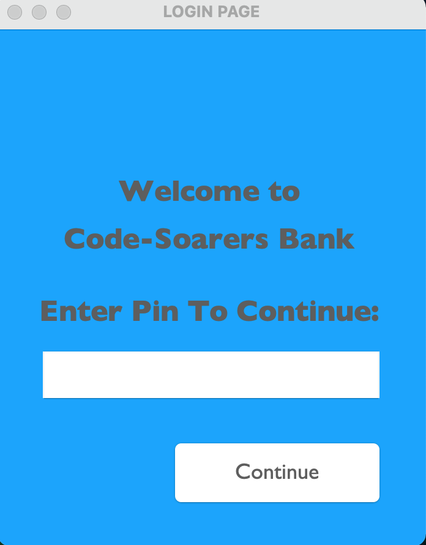
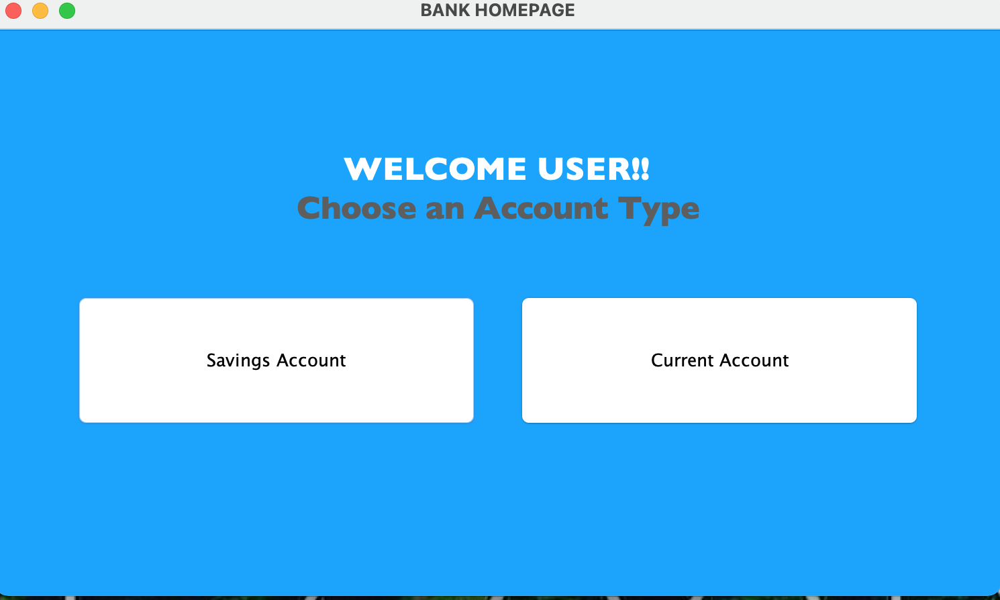
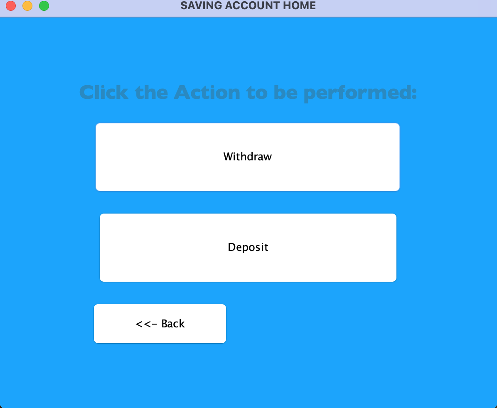
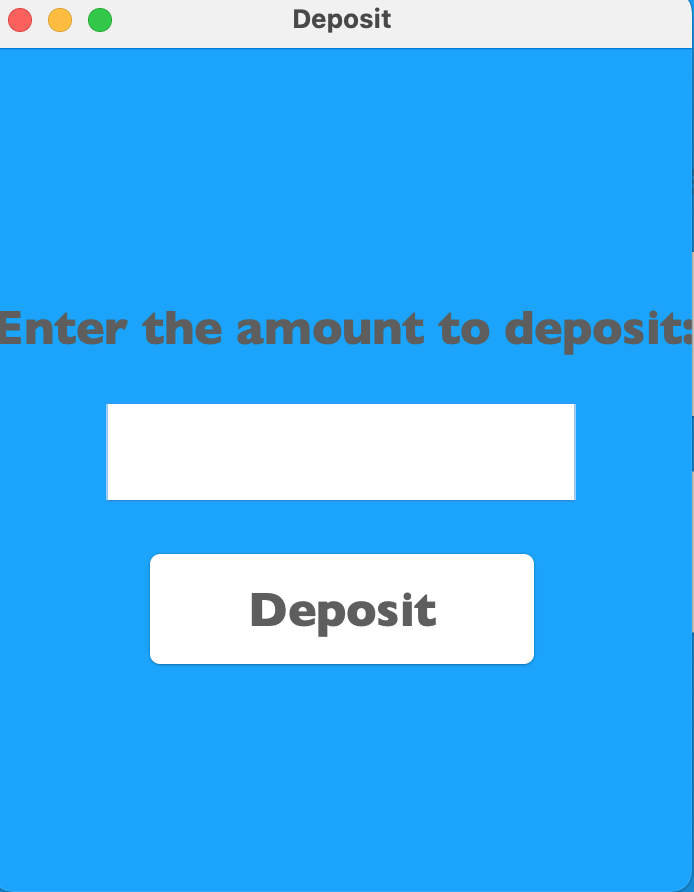
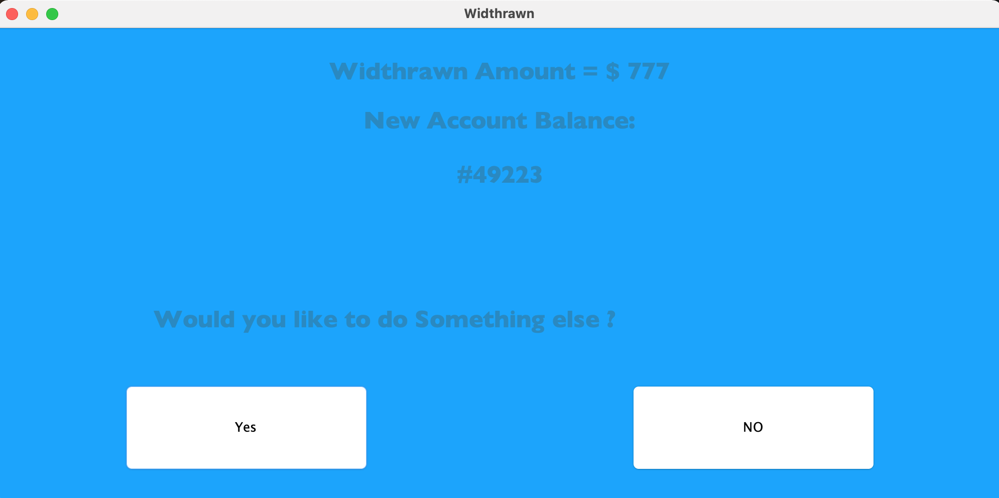

_**CODE-SOARERS BANK ATM USER-INTERFACE**_

This repository contains the source code and documentation for the Bank Code project. The Bank Code is a basic UI system developed to handle basic banking operations, including saving account,current account, depositing.
This README file aims to provide an overview of the project and guide you through understanding it.

The program prompts the user to enter the bank pin, then it prompts the user to choose between a savings and current acccount type which gives the user some level of control over the account. It then takes the user to another page depending on the users choice to either withdraw or deposit an amount and saves the user's input.

